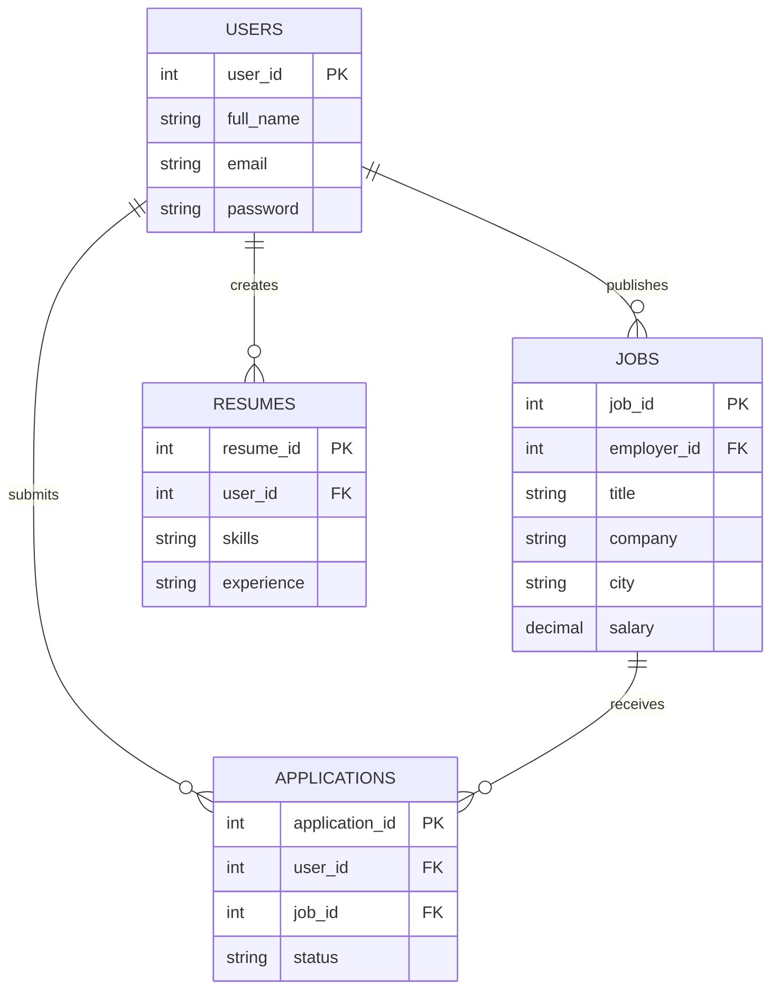

## ER-диаграмма

```mermaid
erDiagram
    USERS ||--o{ JOBS : publishes
    USERS ||--o{ RESUMES : creates
    USERS ||--o{ APPLICATIONS : submits
    JOBS ||--o{ APPLICATIONS : receives

    USERS {
        int user_id PK
        string full_name
        string email
        string password
    }

    JOBS {
        int job_id PK
        int employer_id FK
        string title
        string company
        string city
        decimal salary
    }

    RESUMES {
        int resume_id PK
        int user_id FK
        string skills
        string experience
    }

    APPLICATIONS {
        int application_id PK
        int user_id FK
        int job_id FK
        string status
    }
```